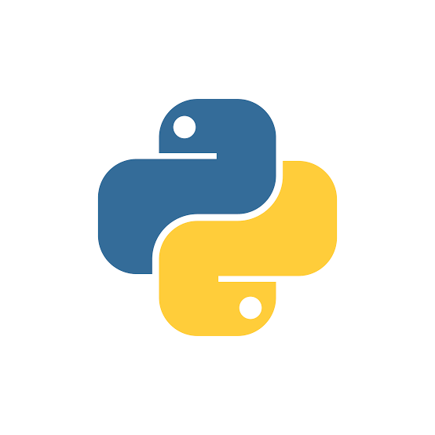

# PYTHON NIGERIA GROUP TASK PROJECT

### on OOP

___
 

This project is intended to improve our colaboration and also consolidate on all the theoritical learnings on OOP in building a *__Real Project__*

lets connect on [x](https://twitter.com/21alul21?s=21&t=hajmNpXlb7o71P1c8IDTUA)

|Tools Used|vim| Pycharm|
|----------|-------|----|
